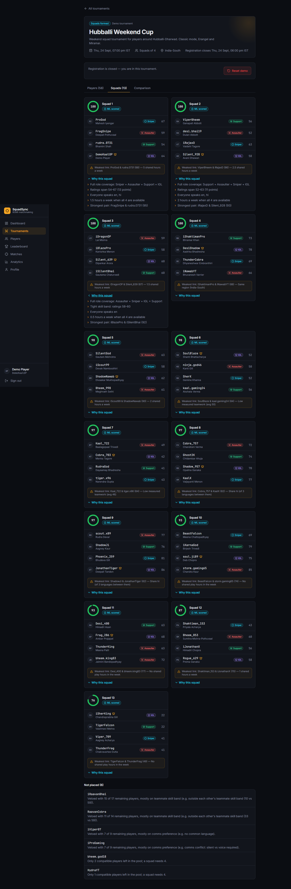
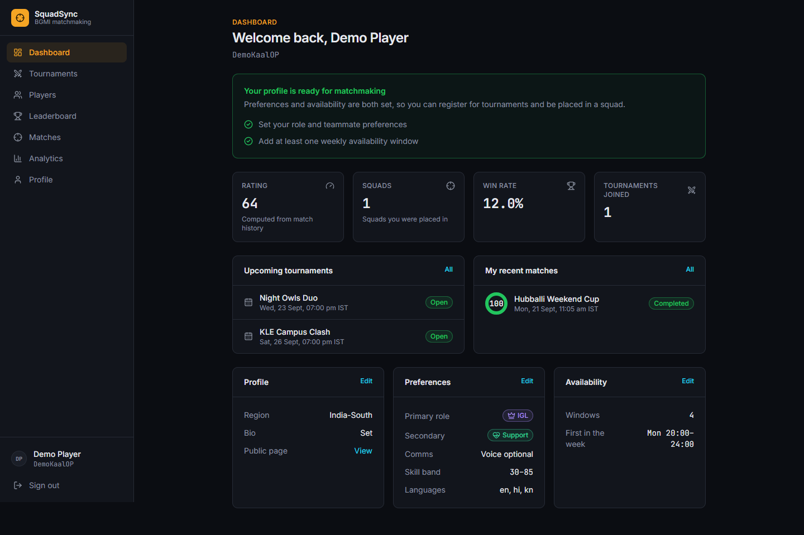
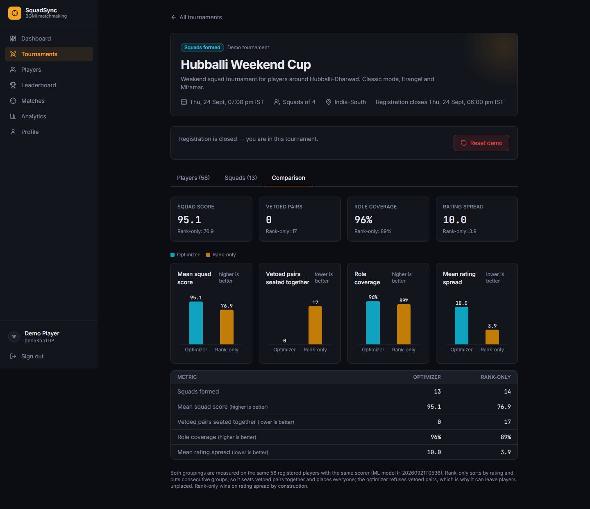
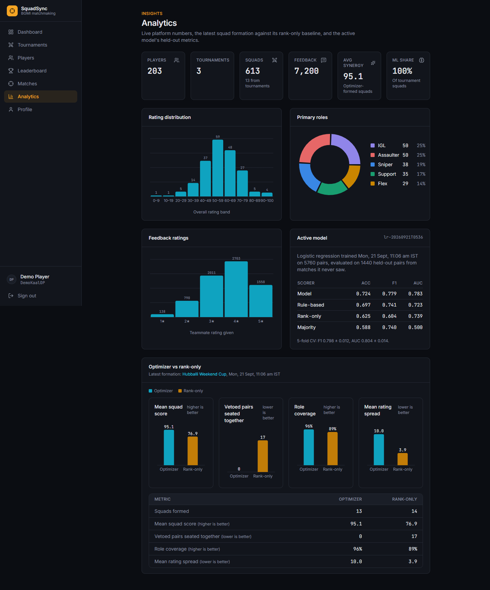
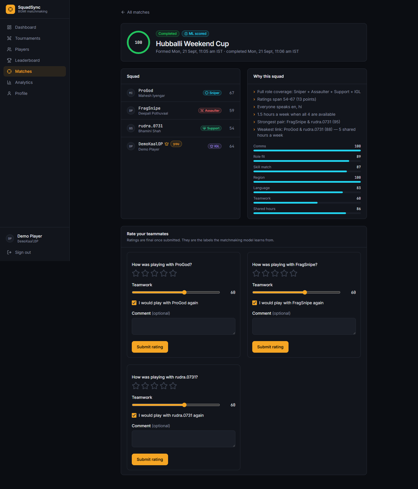
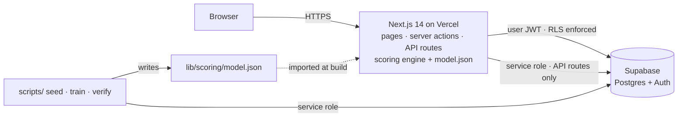
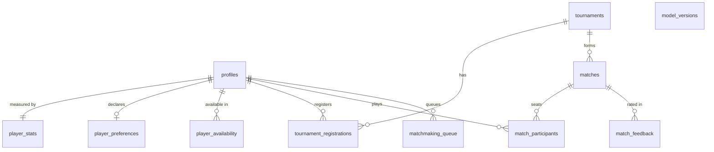

# SquadSync — AI tournament squad matchmaking for BGMI

Forms tournament squads from **skill, role coverage, comms, language and
shared play hours** instead of queue order, and explains why every squad was
put together. A rule-based compatibility engine with hard vetoes, a logistic
regression model trained on peer feedback, and a deterministic squad optimiser,
on Next.js + Supabase.

**Live:** https://bgmi-match-makingsystem.vercel.app · demo tournament:
[`/tournaments/hubballi-weekend-cup`](https://bgmi-match-makingsystem.vercel.app/tournaments/hubballi-weekend-cup)



## Features

- **Tournaments:** browse, register with an optional per-tournament role,
  withdraw while registration is open.
- **One-click squad formation** (organisers) with a synergy score, ML/rule badge, assigned
  roles, expandable "why this squad" reasons and a weakest-link callout.
- **Unplaced players** listed with the rule that blocked them.
- **Optimizer vs rank-only** comparison on the same players, as charts and a table.
- **Matches:** mark completed, rate each teammate (stars, teamwork, play again).
- **Leaderboard** (top 100, role/region filters, IGN search) and **analytics**
  (distributions, role mix, active model metrics).
- **Private by default:** preferences and schedules readable only by their owner.
- Dark-first responsive design system; keyboard and screen-reader friendly.

| | |
|---|---|
|  |  |
|  |  |

More in [`docs/screenshots/`](docs/screenshots) (landing, signup, profile,
availability, tournaments, players tab, leaderboard, mobile).

## Architecture



Details: [`docs/architecture.md`](docs/architecture.md).

## Data model



11 tables, 23 RLS policies, a definer view (`leaderboard_v`) and two aggregate
functions. Details: [`docs/database.md`](docs/database.md).

## Tech stack

| Layer | Choice | Why |
|---|---|---|
| Framework | Next.js 14 App Router, TypeScript | Server components + server actions keep data access on the server |
| Styling | Tailwind CSS, CSS-variable tokens | One token set drives dark and light themes |
| Data | Supabase (Postgres, Auth, RLS) | The database enforces access; the public anon key is safe |
| Validation | Zod | One schema per form, mirroring the table CHECKs |
| Charts | Recharts | SVG, themeable through CSS variables |
| ML | Logistic regression in TypeScript | Explainable, no dependencies, training and serving share code |
| Tests | Vitest | Fast unit tests for the pure engine and routes |
| Hosting | Vercel | Deploy on push to `main` |

## How matching works

**Pair score** (`lib/scoring/compatibility.ts`), each component in [0, 1]:

```
pair = 0.30·skill + 0.20·role + 0.15·availability + 0.10·comms
     + 0.10·language + 0.10·region + 0.05·teamwork

skill        = exp(−Δrating² / (2·15²))
role         = best of the 5×5 role matrix over primary/secondary roles
availability = min(1, shared UTC weekly minutes / 360)
language     = Jaccard overlap
```

**Hard vetoes** force the pair to 0 and are never seated together: rating
outside either player's teammate band; silent vs voice-required; no common
language.

**Model blend:** `0.7 · P(rating ≥ 4) + 0.3 · pair`, vetoes applied first.

**Squad score:** mean pair + 0.10 · role coverage − 0.10 · rating spread.
**Optimizer:** greedy fill in registration order with a role-coverage bonus,
then best-improvement swaps (≤ 200). Deterministic.

## ML results

Held-out test set of 1,440 directed pairs from matches never seen in training
(split by match). Full report, confusion matrix and feature importance:
[`docs/ml-results.md`](docs/ml-results.md); method: [`docs/ml.md`](docs/ml.md).

| Scorer | Accuracy | F1 | ROC-AUC |
|---|---|---|---|
| **Logistic regression** | **0.724** | **0.779** | **0.783** |
| Rule-based pair score | 0.697 | 0.741 | 0.723 |
| Rank-only (rating gap < 10) | 0.625 | 0.604 | 0.739 |
| Majority class | 0.588 | 0.740 | 0.500 |

5-fold match-grouped CV: F1 0.798 ± 0.012, AUC 0.804 ± 0.014.

Training labels are generated from hidden latent traits while features come
from noisy observables, so the model cannot score well by re-deriving the
label formula ([why](docs/ml.md#4-why-the-labels-are-not-circular)).

## Optimizer vs rank-only

Hubballi Weekend Cup on production, 58 registered players ([`docs/verification.md`](docs/verification.md)):

| Metric | Optimizer | Rank-only |
|---|---|---|
| Squads | 13 | 14 |
| Mean squad score (×100) | **95.2** | 75.5 |
| Vetoed pairs seated together | **0** | 18 |
| Role coverage | **96%** | 88% |
| Mean rating spread | 9.8 | **3.6** |

## Security

- RLS on all 11 tables; preferences and availability owner-only.
- Service-role key read only in `app/api/**/route.ts` and `scripts/`; every
  route authenticates first.
- Registration, withdrawal and feedback rules enforced by policies and
  exercised as real attacks in `scripts/e2e-local.ts`.
- Only organisers can form squads or reset demo tournaments (0006); players
  cannot grant themselves the role.
- Squad formation claims the tournament atomically; failures roll back.

Threat → mitigation table: [`docs/security.md`](docs/security.md).

## Getting started

### Prerequisites

Node.js 20+, Docker (for the local Supabase stack).

### Installation

```bash
npm install
npx supabase start                 # local Postgres + Auth in Docker
npx supabase migration up --local  # apply 0001–0005
cp .env.example .env.local         # fill values from `npx supabase status`
npx tsx scripts/seed.ts --target local
npx tsx scripts/train.ts --target local
npx tsx scripts/set-organiser.ts --target local --email you@example.com
npm run dev
```

### Environment variables

| Name | Where | Purpose |
|---|---|---|
| `NEXT_PUBLIC_SUPABASE_URL` | app | Supabase project URL (public) |
| `NEXT_PUBLIC_SUPABASE_ANON_KEY` | app | Public anon key, constrained by RLS |
| `SUPABASE_SERVICE_ROLE_KEY` | server only | API routes; bypasses RLS |
| `PROD_SUPABASE_URL` | `.env.production.local` | `scripts/ --target prod` |
| `PROD_SUPABASE_SERVICE_ROLE_KEY` | `.env.production.local` | `scripts/ --target prod` |
| `NEXT_DIST_DIR` | optional | Build output folder (e.g. `.next-build` while `next dev` runs) |

`.env.example` lists names only; real values never enter git.

## Testing

```bash
npm test                                          # 84 unit tests
npx tsx scripts/verify-prod.ts --target local     # schema through REST
npx tsx scripts/demo-user.ts --target local
npx tsx scripts/e2e-local.ts                      # 36 end-to-end checks (dev server running)
```

CI runs typecheck, lint, tests and build on every push. See
[`docs/testing.md`](docs/testing.md).

## Deployment

Vercel deploys `main`. Production migrations are pasted into the Supabase SQL
Editor and verified through REST — no CLI or direct database connection. See
[`docs/deployment.md`](docs/deployment.md).

## Limitations

- Training data is synthetic; metrics show the pipeline recovers a known
  generating process, not how real players behave.
- A single global organiser role: organisers can form squads for any
  tournament (no per-tournament ownership).
- Squad quality is modelled pairwise.
- Ratings are seeded, not computed from imported match statistics.

## Future work

Real-feedback retraining, an organiser role and live queue matchmaking,
squad-level models, probability calibration and a learned blend weight.

## Documentation

[`architecture`](docs/architecture.md) · [`database`](docs/database.md) ·
[`api`](docs/api.md) · [`ml`](docs/ml.md) · [`ml-results`](docs/ml-results.md) ·
[`testing`](docs/testing.md) · [`deployment`](docs/deployment.md) ·
[`security`](docs/security.md) · [`verification`](docs/verification.md) ·
[`report content`](docs/report-content.md) · [`slides`](docs/ppt-outline.md) ·
[`viva questions`](docs/viva-questions.md)

## Team

Abhishek GR · Shivakumar SH · Aishwarya YH · Aniketana SD
Guide: **Dr. Vishwanath K** · KLE Institute of Technology, Hubballi

*Academic prototype. Not affiliated with Krafton or BGMI.*
