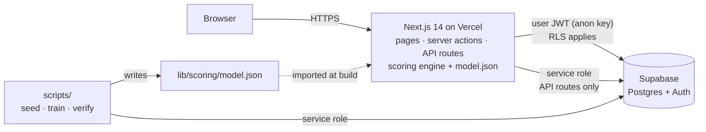
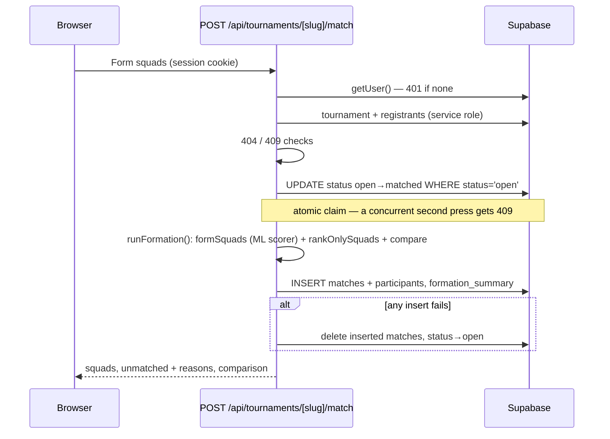

# System architecture

How the system is put together, and why. Companion documents:
[`database.md`](database.md) (schema), [`api.md`](api.md) (routes),
[`ml.md`](ml.md) (model), [`security.md`](security.md) (threat model).

---

## 1. System context



Three runtime participants:

1. **Browser.** Renders the UI and holds no credential beyond the user's own
   session cookie. It talks only to the Next.js origin; the anon key in the
   bundle is a public identifier, not a secret (see `lib/supabase/client.ts`).
2. **Next.js (App Router).** Pages and server actions run **as the user**
   (cookie session, anon key, RLS enforced). Five API route handlers under
   `app/api/**` additionally use the **service role** — each authenticates the
   caller first. The squad-formation engine and the trained model are plain
   TypeScript modules inside this process.
3. **Supabase.** Postgres with row-level security, plus Auth. The schema is
   `supabase/migrations/0001–0005`; the database, not the web tier, is the
   security boundary.

Offline, `scripts/` (run with `tsx`) seeds synthetic data, trains the model and
verifies deployments, all through supabase-js with the service role.

---

## 2. Folder boundaries

```
app/
  (auth)/            login, signup, their server actions
  (app)/             every signed-in page, one shell layout
    tournaments/     list, detail, registration actions
    matches/         history, detail, feedback action
    leaderboard/ analytics/ players/ profile/ dashboard/
  api/               the ONLY app code allowed the service role
  auth/              callback + signout endpoints
components/
  ui/                design-system primitives (Button, Card, Tabs, Dialog…)
  shell/             sidebar, mobile tab bar, route states
  charts/ tournament/ match/ player/
lib/
  scoring/           pure engine: compatibility, squad, baseline, evaluate,
                     features, logistic, model, formation, vectors
  tournaments/       service-role data layer (takes a client, never makes one)
  supabase/          browser / server / middleware / admin clients
  validation/ player/ api/
scripts/             seed, train, verify-prod, e2e-local, screenshots, demo-user
supabase/            migrations 0001-0005, catalog verify scripts
types/database.ts    hand-maintained schema types
```

Rules that hold across the tree:

- **`lib/scoring/` does no I/O.** Everything that scores, forms or evaluates
  squads takes plain objects and returns plain objects. That is why the same
  code runs in an API route, in the trainer, and in 81 unit tests.
- **The service-role key is read only in `app/api/**/route.ts` and `scripts/`.**
  `lib/supabase/admin.ts` accepts the key as an argument rather than reading it,
  so `grep SUPABASE_SERVICE_ROLE_KEY` is a complete audit of its use.
- **Pages never use the service role.** Where a page needs data across players
  that RLS hides (analytics), a `SECURITY DEFINER` SQL function returns
  aggregates only (`analytics_overview()`); where it needs lineups
  (tournament squads), it calls an authenticated API route.

---

## 3. Request paths

### Registering for a tournament

`workspace.tsx` → server action `registerForTournament` → checks profile
completeness → `INSERT tournament_registrations` **as the user**. The RLS policy
`tournament_registrations_insert_own_open` enforces "only yourself, only while
open, only before the deadline". A duplicate is a `23505`, mapped to
"You're already registered".

### Forming squads



### Completing a match and giving feedback

`POST /api/matches/[id]/complete` first reads the match **with the user's
client** — under RLS only participants can see it, so visibility *is* the
participation check — then stamps `started_at`/`ended_at` with the service
role. Feedback is a server action inserting as the user; the 0003 policy
requires rater = caller, both players seated, match completed.

---

## 4. The scoring engine

```
PlayerVector ──► compatibility.pairScore ──► PairResult {score, reasons, components, veto}
                        │
            model.makeMlScorer (0.7 · P(rating≥4) + 0.3 · rule)
                        │  vetoes checked first, always win
                        ▼
squad.formSquads ──► greedy fill by registration order ──► swap improvement ──► Squad[]
baseline.rankOnlySquads ──► evaluate.compare ──► optimizer vs rank-only metrics
```

- **Pair score** (`compatibility.ts`): weighted sum of skill (0.30), role
  (0.20), availability (0.15), comms (0.10), language (0.10), region (0.10),
  teamwork (0.05). Skill band, comms (silent × voice-required) and "no common
  language" are hard vetoes that force 0.
- **Squad score** (`squad.ts`): mean pair score + 0.10 × role coverage − 0.10 ×
  normalised rating spread.
- **Formation** is deterministic: registration order seeds squads, ties break
  by registration order, the swap search has a fixed iteration order. The same
  registrations always produce the same squads.

---

## 5. Why one runtime, not two

The Phase 1 plan put the model in a separate Python/FastAPI service with a
rule-based fallback in Next.js. The final build does not, for reasons that
emerged as the project was built:

| Phase 1 argument for Python | What changed |
|---|---|
| ML libraries are Python-only | The chosen model is logistic regression on 8 features. Training and inference are ~100 lines of TypeScript with no dependencies (`lib/scoring/logistic.ts`). |
| Training/serving skew if the two are different programs | Now they are the *same* program: `scripts/train.ts` and the API route import the same `features.ts`. Skew is impossible by construction. |
| Independent release cadence | Retraining writes `model.json`; redeploying it is a normal Vercel deploy (~1 min). |
| Fallback when the service is down | There is no service to be down. The fallback still exists, for a malformed or missing `model.json`, and is tested. |

The cost accepted: a heavier model (gradient boosting, embeddings) would need
the second runtime back. `docs/ml.md` §10 records that as future work.

`matches.scoring_source` survives unchanged in meaning: it records whether the
ML-blended scorer or the rule-only scorer produced each squad.

---

## 6. Rendering and state

- Server components by default; a component is `'use client'` only for state,
  effects or event handlers (forms, tabs, dialogs, charts).
- Every signed-in route has `loading.tsx` (skeleton matching the page) and
  `error.tsx` (retry via `reset()`).
- After a mutation, client components call `router.refresh()` so the server
  re-reads under the user's JWT, rather than keeping a second copy of the
  truth in client state.
- Dates are always formatted with an explicit locale and `Asia/Kolkata`, so a
  UTC server render and an IST browser hydrate identically.
